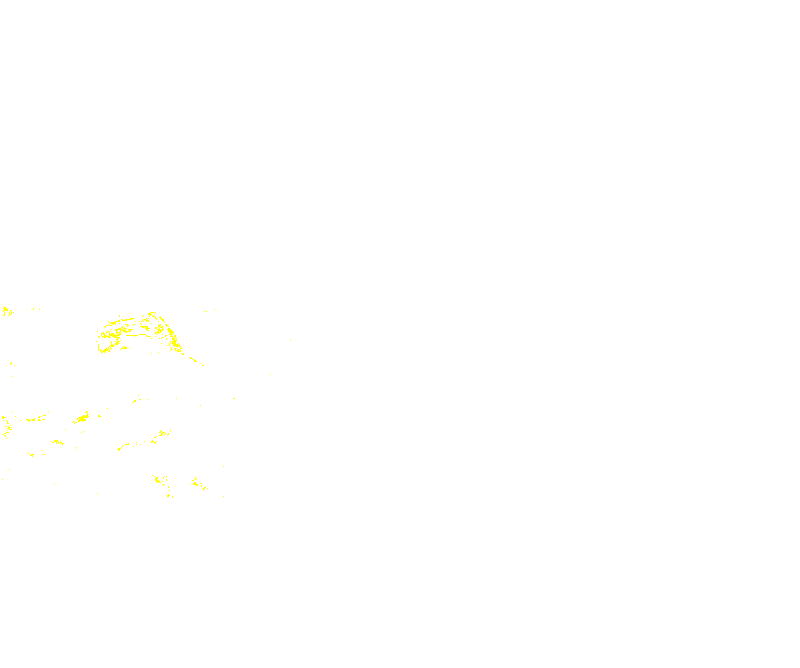

# SAR-Based Flood Inundation Mapping — Guwahati, Assam (2025 Monsoon)

Detecting and mapping flood inundation on the Guwahati / Brahmaputra
floodplain using **Sentinel-1 SAR change detection**, cross-validated
against **Sentinel-2 optical NDWI change detection**, on **Google Earth
Engine**.



## Overview

Flooding is hard to map optically because monsoon events are almost always
accompanied by heavy cloud cover. This project uses **Synthetic Aperture
Radar (SAR)**, which sees through clouds, as the primary flood-detection
signal, and uses optical imagery only as an independent cross-check where
cloud-free scenes are available.

**Pipeline:**

1. Search and inspect Sentinel-1 GRD scenes over the AOI and lock a single
   relative orbit so pre/post images share the same viewing geometry.
2. Compute the pre → post event backscatter change (ΔVV, ΔVH).
3. Speckle-filter and threshold the change layers to get a candidate flood
   mask.
4. Remove permanent water bodies using the JRC Global Surface Water dataset.
5. Independently compute a cloud-masked Sentinel-2 NDWI change mask
   ("new water") for the same period.
6. Intersect the SAR and optical masks to get a cross-validated inundation
   estimate, and report area statistics for each.

## Repository structure

```
.
├── Guwahati_SAR_InundationDetection.ipynb   # main analysis notebook
├── requirements.txt
├── README.md
└── outputs/
    ├── figures/    # PNG snapshots of every key map layer
    ├── rasters/    # GeoTIFF exports of the final flood/water masks
    └── results/    # CSV/JSON tables (time series, thresholds, area stats)
```

The `outputs/` folder in this repo already contains the results from the
run described below, so you can review the maps and numbers without
re-running anything. Re-running the notebook will regenerate them.

## Requirements

- Python 3.9+
- A free [Google Earth Engine](https://earthengine.google.com) account
- A Google Cloud project with the Earth Engine API enabled (the free tier
  is sufficient)

```bash
pip install -r requirements.txt
```

## How to run

1. Clone this repo and install dependencies (above).
2. Open `Guwahati_SAR_InundationDetection.ipynb` in Jupyter, VS Code, or
   Google Colab.
3. In the **Configuration** cell, set `EE_PROJECT` to your own GEE Cloud
   project ID (and, optionally, adjust the AOI / dates / thresholds to
   study a different flood event).
4. Run all cells top to bottom.
   - The **Authentication** cell will open a browser window the first time
     you run it — sign in and authorize Earth Engine. This is a one-time
     step per machine.
   - The notebook creates an `outputs/` folder (if it doesn't already
     exist) and populates it with figures, GeoTIFFs, and summary tables as
     it runs.

No Google Drive export is required — rasters are downloaded directly via
Earth Engine's `getDownloadURL`/thumbnail endpoints, so the whole pipeline
runs end-to-end from a fresh clone.

## Method notes

- **Why a fixed relative orbit?** SAR backscatter depends on incidence
  angle and look direction. Comparing scenes from different orbits
  introduces geometric artifacts that look like change but aren't, so
  pre/post/later scenes are all taken from the same relative orbit
  (`RELATIVE_ORBIT` in Configuration).
- **Why threshold both VV and VH?** Requiring a significant drop in *both*
  polarizations (rather than either one) removes a lot of single-band
  speckle noise from the candidate mask.
- **Why remove permanent water?** Rivers and lakes always look like "water"
  to both SAR and NDWI; without this step they would inflate the flood
  estimate. The JRC Global Surface Water `occurrence` band gives a
  long-term historical water frequency per pixel, so anything with high
  occurrence is excluded before computing flood area.
- **Why cross-validate with optical NDWI?** SAR and optical sensors have
  different failure modes (SAR: layover/shadow in rugged terrain, dense
  urban double-bounce; optical: cloud cover). Agreement between the two
  independent detections is a stronger inundation signal than either alone.

## Results

See `outputs/results/flood_area_summary.json` for the exact figures from
the run in this repo — SAR candidate area, optical new-water area, their
agreement area, and the percentage each dataset supports the other.

## Possible extensions

- Automate pre/post scene selection around any user-supplied event date
- Add a supervised classifier (e.g. Random Forest) on top of the SAR +
  optical stack
- Validate against ground-truth flood reports or high-resolution imagery
- Extend to ascending + descending orbit fusion for daily revisit

## Data sources

- [Sentinel-1 GRD](https://developers.google.com/earth-engine/datasets/catalog/COPERNICUS_S1_GRD) (ESA/Copernicus)
- [Sentinel-2 SR Harmonized](https://developers.google.com/earth-engine/datasets/catalog/COPERNICUS_S2_SR_HARMONIZED) (ESA/Copernicus)
- [JRC Global Surface Water](https://developers.google.com/earth-engine/datasets/catalog/JRC_GSW1_4_GlobalSurfaceWater) (European Commission Joint Research Centre)

## License

Add a license of your choice (e.g. MIT) if you intend this repo to be
publicly reusable.
